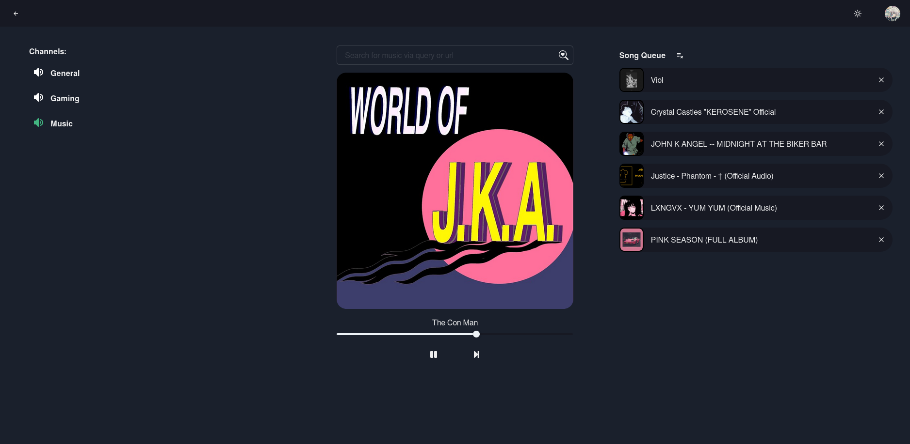

<h1 align="center">
     
    
Waveview Music Dashboard

## About
Waveview is a discord music bot with a build in dashboard for taking greater control of your music experience. You can queue up, play, and enjoy music with your friends with ease.

Waveview is built upon the [Wavelink](https://github.com/PythonistaGuild/Wavelink) library, a Lavalink wraper for [Discord.py](https://fastapi.tiangolo.com/) which handles the music playing functions contained within the bot.

## Preview

	 
	

		
	

## Features

Waveview comes with a bunch of cool features:
- Authentication - Waveview uses discords OAuth2 system to allow users to login and control the bot in the servers they are part of. Authentication only requires the identify scope (userame and profile picture)
- Enhanced Control - Waveview has advanced track controls, including queue reordering, track scrubbing, and queue clearing features.
- Snappy UI - Waveviews UI comes with intuitive but pleasant features that make interacting with the bot easy
- Commands - If commands are more your thing, Waveview comes with those too! All commands  work with the queue
- Seamless Music Playing - Thanks to the Wavelink library, the music playing experience is extremely smooth with no audio tearing

## Installation

### Prerequisites

To set this up locally, it is strongly reccomended that `docker` and `docker-compose` be used. This will provide a fast and reliable way of setting Waveview up.

You will also need to have created a discord bot with all Privileged Gateway Intents turned on. Applications can be created [here](https://discord.com/developers/applications), and you can use the [following guide for reference](https://discordpy.readthedocs.io/en/stable/discord.html).

### Required Configurations

You will need the following 4x environment variables for the Dockerfiles in order for the bot to work:

- Discord bot token -> Found in the developer portal
  - Set this in `bot/Dockerfile` for the variable `BOT_TOKEN`
- Client ID -> Developer Portal (Oauth2 -> General)
  - Set this in `bot/Dockerfile` for the variable `BOT_CLIENT_ID`
- Client Secret (Oauth2 -> General)
  - Set this in `bot/Dockerfile` for the variable `BOT_CLIENT_SECRET`
- Redirect URI (Oauth2 -> URL Generator)
  - Set this in `frontend/Dockerfile` for the variable `NEXT_REDIRECT URI` (See below for details on how to create this)

You can leave the rest of the environment variables as they are. If you plan to self host this, you may change them as needed. Furhter, if you want Spotify support, you should set the `SPOTIFY_CLIENT_ID` and `SPOTIFY_CLIENT_ID` environment variables.

#### Creating a Redirect URI

In the developer portal under OAuth2->General, add a redirect for `http://localhost:5090/auth/redirect`.

Navidate to OAuth2->URL Generator. Set scopes to `identify`, and select the redirect URL to be the redirect we just created.

## Contributing

Waveview is completely open to contributions, whether that be in adding features, improvements or documentation.

Please feel free to raise an Issue if needed.

## Contact
 
The best way to contact me is on Discord: `k4br`

